# Real-Time Chat Application using Firebase

Chat Application is a Flutter-based mobile app that enables users to send and receive messages in real time. The app uses **Firebase** for authentication and database services, and **SharedPreferences** for local session management.

---

## Features

1. **Signup Page (Create Account)**
   - Users can create an account using email and password.
   - Firebase Authentication handles account creation.

2. **Signin Page (Login Account)**
   - Users can log in using email and password.
   - Login state is saved locally using SharedPreferences.

3. **Forget Password Page**
   - Users can request a password reset email.
   - Firebase sends the reset email to the registered Gmail account.

4. **Home Page**
   - Displays all users.
   - Search functionality to find users by username.
   - Navigate to chat page or chatroom with selected user.

5. **Chat Page**
   - Real-time messaging using Firebase Firestore.
   - Send and receive messages instantly.

6. **Separate Chatroom Page**
   - Each user has a unique chatroom with a particular username.
   - Messages are loaded from Firestore based on chatroom ID.
   - Scrollable list with timestamps for each message.

7. **Text Messaging**
   - Users can send text messages to other users.
   - Messages are stored in Firestore and synced in real-time.

8. **SharedPreferences Integration**
   - Maintains login session locally so users remain logged in even after closing the app.

---

## Getting Started

### Prerequisites

- Flutter >= 3.0.0  
- Dart >= 3.1.0  
- Firebase account  

### Installation

1. **Clone or download the project**
   ```bash
   git clone https://github.com/bhartisahu09/Chat-App
   cd chat_application
   ```

2. **Install dependencies**
   ```bash
   flutter pub get
   ```

3. **Run the app**
   ```bash
   flutter run
   ```

## Screenshots


#### Chat_user1
| SignUp Screen | SignIn Screen | Forget Password | Reset Password |
|:---:|:---:|:---:|:---:|
| 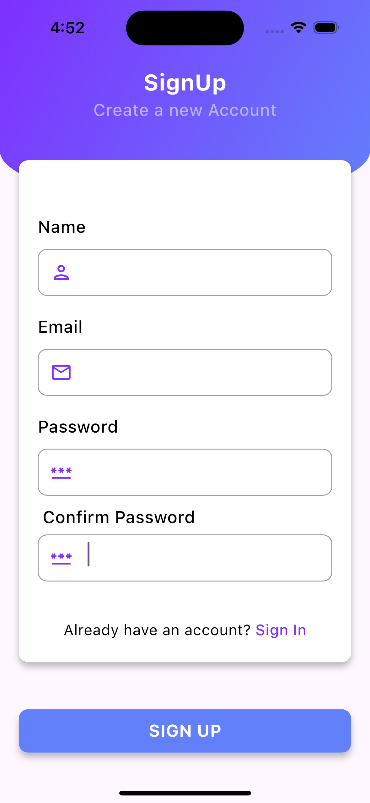 |  | 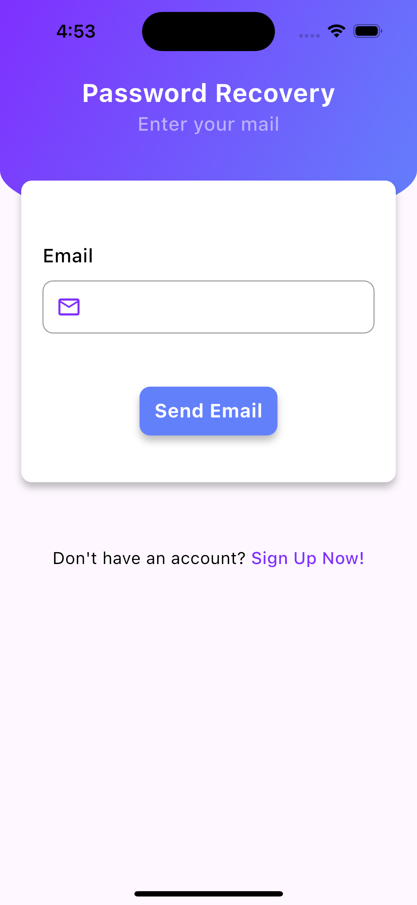 | 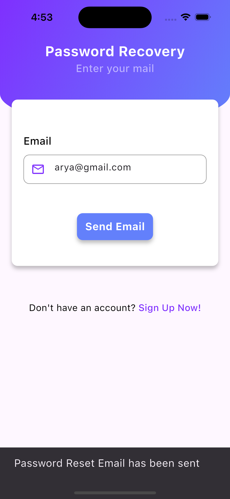 

| Home Screen | Search Screen | Search User List | Search User |
|:---:|:---:|:---:|:---:|
|  |  | 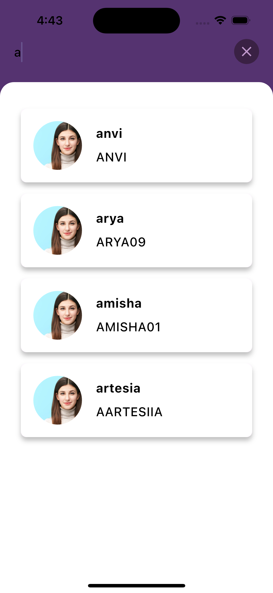 | 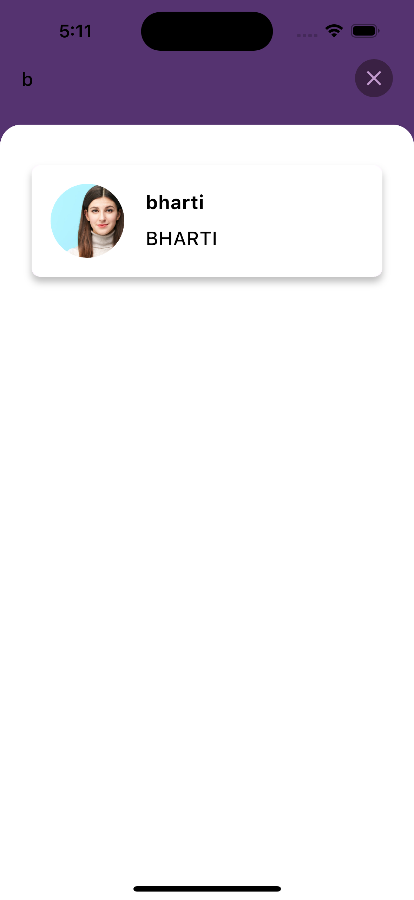 |

| Chat1 Send Msg | 
|:---:|
| 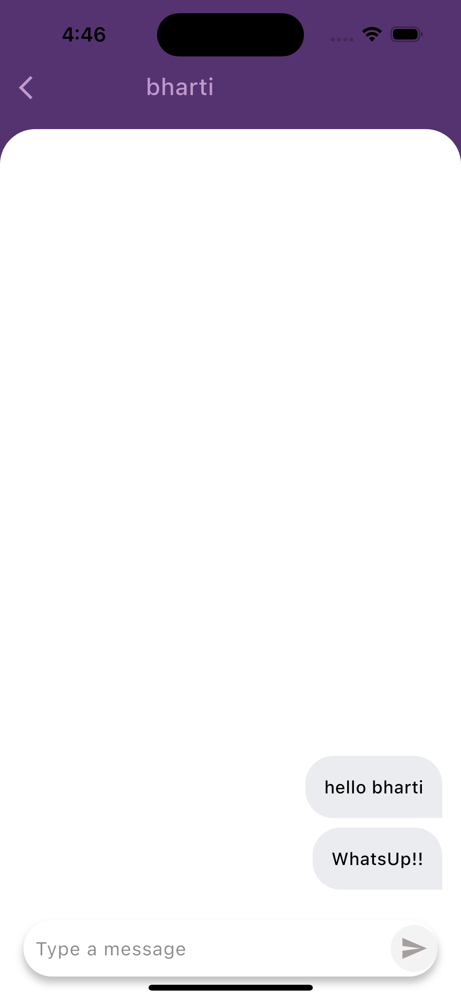 | 

#### Chat_user2
| Chat 2 Receive Msg | Chat2 ChatRoom Receive Msg | Chat2 Send Msg to User1 |
|:---:|:---:|:---:|
|  | 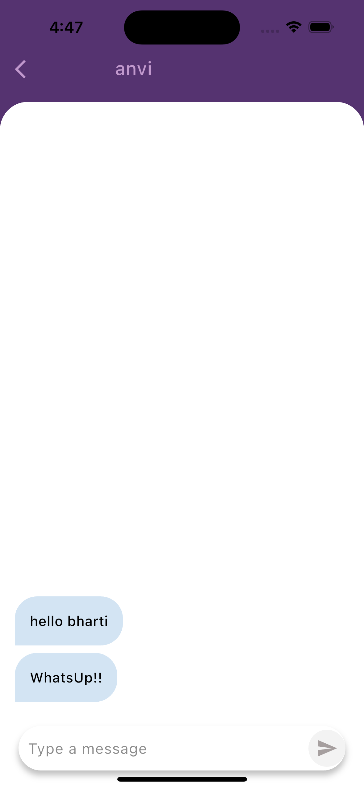 | 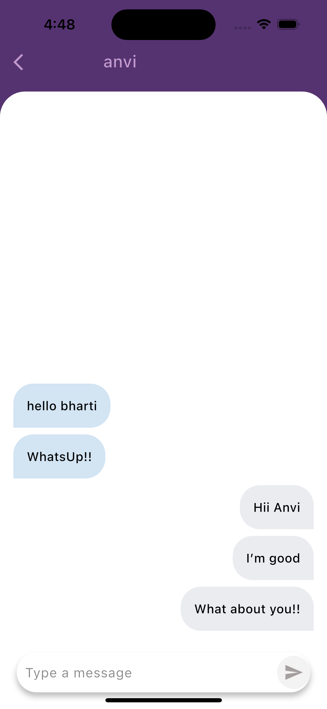 |

#### Chat_user1
| Chat1 Receive Msg | Chat1 ChatRoom Receive Msg |
|:---:|:---:|
|  | 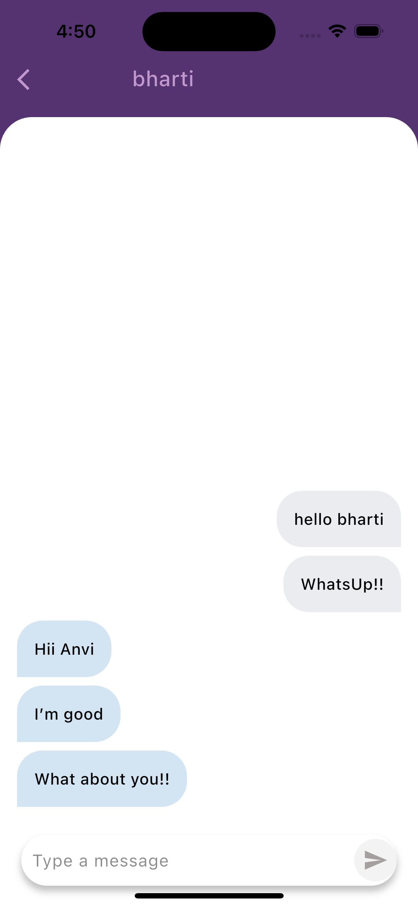 |

| LogOut App | LogOut PopUp | LogOut and Navigate to login screen |
|:---:|:---:|:---:|
|  | 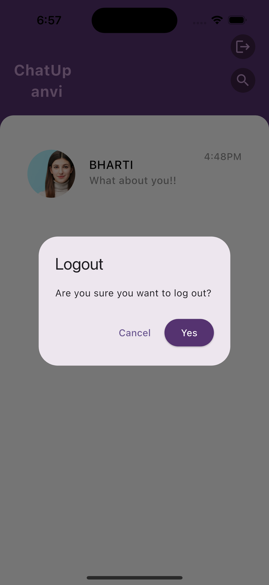 | 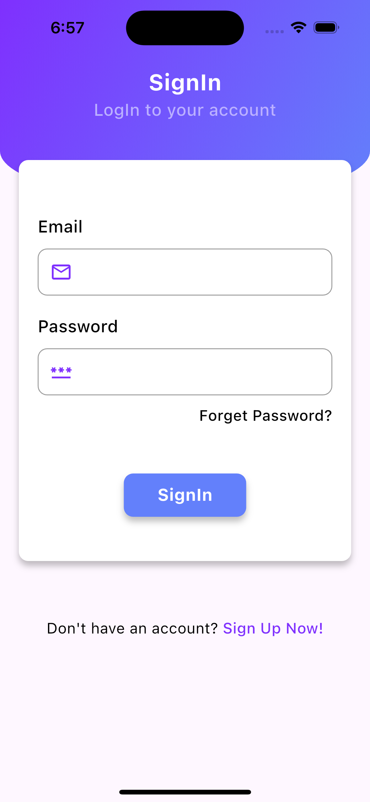 |
